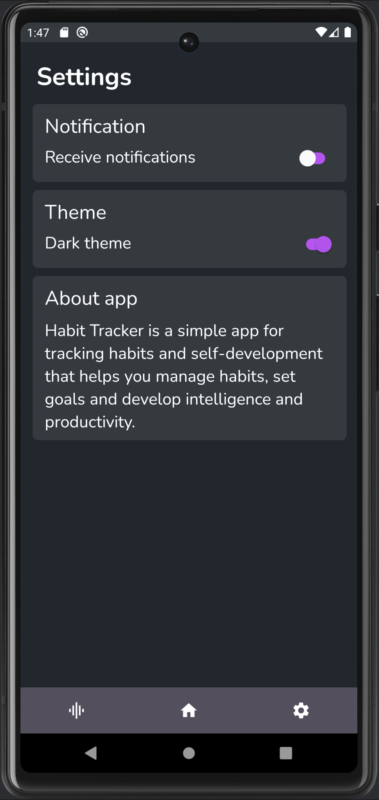

# Habito

Habito - это простое и удобное приложение для отслеживания привычек и саморазвития, которое помогает управлять привычками, ставить цели, развивать интеллект и продуктивность.

## Содержание

1. [Регистрация](#регистрация)
2. [Главный экран](#главный-экран) \
   2.1. [Основное](#основное) \
   2.2. [Добавление привычки](#добавление-привычки) \
   2.3. [Изменение и удаление привычки](#изменение-и-удаление-привычки) \
   2.4. [Изменение статуса привычки](#изменение-статуса-привычки)
3. [Экран выполненных привычек](#экран-выполненных-привычек)
4. [Экран анализа](#экран-анализа)
5. [Экран настроек](#экран-настроек)

## Регистрация

При первом открытии приложения пользователю необходимо ввести свое имя. Оно сохранится в SharedPreferences и будет использоваться для приветствия на главном экране.

## Главный экран

### Основное

Экран содержит:

- приветствие пользователя в зависимости от времени суток;
- иконку `флажка`, при нажатии на которую пользователь может посмотреть список выполненных привычек ();
- календарь на текущую неделю;
- круговую диаграмму, которая отображает количество выполненных за день привычек;
- список привычек;
- `плавающую кнопку` для добавления новой привычки.

### Добавление привычки

При нажатии на плавающую кнопку с иконкой `+` приложение покажет диалоговое окно с полями для ввода необходимых данных.

На всех полях также работает валидация, срабатывающая при нажатии на кнопку `create new`. Если ввод не прошел проверку, то пользователь увидит соответствующее сообщение.

### Изменение и удаление привычки

Все привычки, созданные пользователем, имеют дополнительное меню, которое можно увидеть при нажатии на `три точки` у соответствующего элемента списка.

- `change`: приложение покажет тот же диалог, что и при созданни привычки. Данные подгружаются из SQLite с использованием библиотки Room;
- `delete`: приложение удалит привычку.

### Изменение статуса привычки

Привычка имеет два статуса: выполненная и невыполненная. На главном экране отображается список невыполненных привычек. Чтобы отметить привычку выполненной, необходимо нажать на `checkbox` на соответствующем элементе списка.

## Экран выполненных привычек

Этот экран отображает все привычки, выполненные пользователем за день. В каждом элементе списка присутствует кнопка `возврата`. Она возвращает привычку в статус невыполенной. Это сделано для того, чтобы если пользователь случайно отметит привычку выполненной, он мог вернуть ее на главный экран.

## Экран анализа

На этом экране отображается список всех привычек. Каждый эелемент списка содержит название привычки, `progress bar`, который может принимать значения от 0 до 7, и текстовое описание того, сколько раз за неделю эта привычка была выполнена.

Каждый элемент списка кликабельный: при нажатии в карточке в верхней половине страницы отображается информация, в т.ч. текущее количество дней, оставшихся до завершения этой привычки.

## Экран настроек

Экран содержит два блока стандартных настроек: уведомления и цветовая тема. Пользователю предоставляется две темы: темная (default) и светлая.

Третий блок - краткое описание самого приложения.

